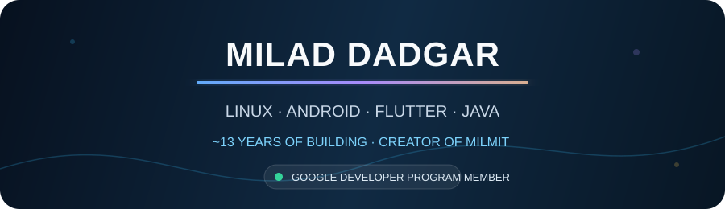

### Building useful, secure, and human-centered software since ~2013

**English** · [فارسی](#خلاصه-فارسی)

## About me

I am **Milad Dadgar**, a software builder with approximately **13 years of programming experience**. I create practical products across Linux desktop software, system utilities, privacy-aware automation, networking, WordPress, WooCommerce, and API integrations.

I am the creator of **[MilMit](https://github.com/MilMit)** and a **member of the Google Developer Program**. My work favors clear architecture, honest capability claims, secure privilege boundaries, reproducible releases, and software that solves real problems.

## Core areas

| Area | Technologies and focus |
| --- | --- |
| Linux desktop | Rust, GTK4, Libadwaita, Electron |
| Web and commerce | WordPress, WooCommerce, PHP, JavaScript |
| Systems and networks | Linux, VPN, IKEv2, WireGuard, automation |
| Product engineering | UX, packaging, CI/CD, security, documentation |

## Featured work

<table>
<tr>
<td width="50%" valign="top">

### [LinuxCare](https://github.com/MilMit/LinuxCare-App)

Safety-first Linux maintenance, diagnostics, and health intelligence built with **Rust, GTK4, and Libadwaita**. Designed around narrow Polkit boundaries, evidence-based diagnostics, and reversible actions where reversal is real.

</td>
<td width="50%" valign="top">

### [ChatDesk Linux](https://github.com/MilMit/chatdesk-linux)

An unofficial ChatGPT desktop experience for Linux with isolated profiles, native workflows, Quick Capture, workspaces, diagnostics, privacy-aware local history, and verified Linux release artifacts.

</td>
</tr>
<tr>
<td width="50%" valign="top">

### [IKEv2 Linux for Surfshark](https://github.com/MilMit/ikev2-linux-for-surfshark)

An unofficial Ubuntu-first IKEv2 client project with StrongSwan, secure secret storage, offline-capable location data, and a deliberately narrow privileged boundary.

</td>
<td width="50%" valign="top">

### [NordVPN WireGuard Extractor](https://github.com/MilMit/nordvpn-wireguard-extractor)

A lightweight Linux utility that extracts NordLynx/WireGuard configurations and produces mobile-friendly QR codes.

</td>
</tr>
</table>

## Research

My background also includes biomedical research involving **alpha-tocopherol succinate** and nanoparticle-induced cellular damage.

> **“Protective effect of alpha-tocopherol succinate on Al₂O₃-NPs induced damage in NMRI mice Sertoli cells: the role of inhibin B and Connexin 43”**  
> *Molecular Biology Reports* (2026)  
> [DOI: 10.1007/s11033-026-11566-8](https://doi.org/10.1007/s11033-026-11566-8) · PMID: 41774233

## Engineering principles

- Security boundaries should be narrow, explicit, and reviewable.
- Product claims must match what the software can actually do.
- Maintenance actions should be reversible whenever reversal is technically real.
- Releases should be testable, traceable, documented, and easy to verify.
- Good software must respect the user's privacy, time, and attention.

## خلاصه فارسی

من **میلاد دادگر** هستم؛ برنامه‌نویس و سازنده نرم‌افزار با حدود **۱۳ سال سابقه برنامه‌نویسی**. بنیان‌گذار برند **MilMit** و عضو **Google Developer Program** هستم.

تمرکز اصلی من روی توسعه نرم‌افزارهای لینوکس، برنامه‌های دسکتاپ، ابزارهای سیستمی و شبکه، اتوماسیون، وردپرس، ووکامرس و یکپارچه‌سازی API است. در کنار برنامه‌نویسی، سابقه پژوهش علمی در زمینه آلفا توکوفرول سوکسینات و آسیب سلولی ناشی از نانوذرات را نیز دارم.

## Connect

- **GitHub organization:** [MilMit](https://github.com/MilMit)
- **Website:** [milmit.net](https://milmit.net)

---

  Milad Dadgar · میلاد دادگر · Building practical software under MilMit

